# Arquitectura del Frontend — StreamCoreOS

Vertical-slice: cada feature vive en su propia carpeta bajo `lib/features/*`,
espejando el mismo patrón que el backend (`domains/*`). Las rutas (`routes/*`)
son wrappers finos que solo importan y acomodan componentes — no tienen
lógica propia. Todo lo que no es de un dominio específico (API client,
stores de sesión, sidebar) vive en `lib/core/`. Los componentes visuales
genéricos (sin conocimiento de ningún dominio) viven en `lib/components/ui/`.

```mermaid
flowchart TD
    AppHtml["app.html"]
    RootLayout["routes/+layout.svelte<br/>Sidebar · ModeWatcher · Toaster<br/>polling de auth · conecta chat/alerts"]
    AppHtml --> RootLayout

    %% ── Core: infraestructura compartida, sin lógica de dominio ──
    subgraph CoreInfra["lib/core/ — infraestructura compartida"]
        ApiClient["api/client.ts<br/>get · post · put · del · sse()"]
        AuthStore["stores/auth.svelte.ts"]
        ScopesStore["stores/scopes.svelte.ts"]
        StreamStore["stores/stream.svelte.ts"]
        ToastStore["stores/toast.svelte.ts"]
        Sidebar["components/Sidebar.svelte"]
        FeaturesConfig["features.config.ts<br/>lista de nav"]
    end
    RootLayout --> Sidebar
    RootLayout --> AuthStore
    Sidebar --> FeaturesConfig

    %% ── Routes: páginas finas ──
    subgraph Routes["routes/* — páginas finas (solo componen)"]
        RPanel["/ (Panel)"]
        RViewers["/viewers"]
        RSubs["/subscribers"]
        RCommands["/commands"]
        RModeration["/moderation"]
        RTimers["/timers"]
        RTts["/tts"]
        RAi["/ai"]
        RSystem["/system"]
        RSettings["/settings (+ /webhooks)"]
        ROverlaysAdmin["/overlays (lista)"]
        ROverlaysBuilder["/overlays/builder/[id]"]
        ROverlaysLive["/overlays/live/[id]<br/>URL pública, la abre OBS"]
    end
    RootLayout --> RPanel
    RootLayout --> RViewers
    RootLayout --> RSubs
    RootLayout --> RCommands
    RootLayout --> RModeration
    RootLayout --> RTimers
    RootLayout --> RTts
    RootLayout --> RAi
    RootLayout --> RSystem
    RootLayout --> RSettings
    RootLayout --> ROverlaysAdmin

    %% ── Features: un dominio = una carpeta ──
    subgraph Features["lib/features/* — un dominio = una carpeta"]
        FViewers["viewers/"]
        FSubs["subscribers/"]
        FCommands["commands/"]
        FModeration["moderation/"]
        FTimers["timers/"]
        FTts["tts/"]
        FAi["ai/"]
        FSystem["system/"]
        FChat["chat/<br/>AlertFeed · stores de chat"]
        FDashboard["dashboard/<br/>StreamStatus · ManualActions"]
        FAuth["auth/<br/>LoginForm · TwitchPermissions"]
        FOverlays["overlays/<br/>builder + widgets + dataSource"]
    end
    RViewers --> FViewers
    RSubs --> FSubs
    RCommands --> FCommands
    RModeration --> FModeration
    RTimers --> FTimers
    RTts --> FTts
    RAi --> FAi
    RSystem --> FSystem
    RPanel --> FDashboard
    RPanel --> FChat
    RSettings --> FAuth
    ROverlaysAdmin --> FOverlays
    ROverlaysBuilder --> FOverlays
    ROverlaysLive --> FOverlays

    %% ── UI compartida: sin lógica de dominio ──
    subgraph UI["lib/components/ui/* — design system"]
        UIBadge["Badge"]
        UIButton["Button"]
        UICard["Card"]
        UIDialog["Dialog"]
        UIInput["Input"]
        UISwitch["Switch"]
        UITable["Table"]
        UITabs["Tabs"]
        UITextarea["Textarea"]
        UISlider["Slider"]
    end
    FViewers --> UICard
    FSubs --> UITable
    FCommands --> UIBadge
    FModeration --> UISwitch
    FModeration --> UIDialog
    FTimers --> UIInput
    FTts --> UITabs
    FAi --> UICard
    FDashboard --> UICard
    FOverlays --> UISlider

    FViewers --> ApiClient
    FSubs --> ApiClient
    FCommands --> ApiClient
    FModeration --> ApiClient
    FTimers --> ApiClient
    FTts --> ApiClient
    FAi --> ApiClient
    FDashboard --> ApiClient
    FChat --> ApiClient

    %% ── Camino especial de overlays: tiempo real hacia OBS ──
    subgraph OverlayPath["Camino especial — builder en vivo hacia OBS"]
        DataSource["overlays/dataSource.svelte.ts<br/>un solo SSE · modo 'preview' o 'live'"]
        WidgetReg["WIDGET_REGISTRY<br/>Stat · Alert · Media · Banner<br/>ChatHighlight · ProgressBar · CustomCode"]
    end
    FOverlays --> DataSource
    DataSource --> WidgetReg
    DataSource -.->|"SSE: /api/overlays/stream/{id}<br/>multiplexado, un solo canal"| BackendOverlay["Backend: OverlayStreamPlugin"]
    ROverlaysLive -.->|"no monta Sidebar<br/>(chequeo especial en +layout.svelte)"| RootLayout
```

## Notas de lectura

- **`routes/*` nunca contienen lógica** — solo importan 2-4 componentes de `lib/features/*` y los acomodan en el layout de la página. Para saber "qué hace la página X", mirá el feature, no la ruta.
- **`lib/core/` es lo único que puede cruzar features** — el API client, los stores de sesión/auth, el Sidebar. Ningún feature importa de otro feature directamente.
- **`lib/components/ui/*` no sabe nada de ningún dominio** — recibe props (`checked`, `value`, `variant`, `onCheckedChange`) y nada más. Es infraestructura compartida, no acoplamiento entre features (igual que los `tools/` del backend respecto a los `domains/`).
- **Overlays es el único camino con requisitos de tiempo real** — `dataSource.svelte.ts` centraliza la única conexión SSE por overlay (antes eran 3 conexiones separadas), y la usan tanto el builder (modo `preview`, datos de ejemplo) como la página en vivo que abre OBS (modo `live`, datos reales). `routes/overlays/live/[id]` es la única ruta pública/sin autenticación — el layout raíz la detecta y no monta el Sidebar ni el resto del shell autenticado.
