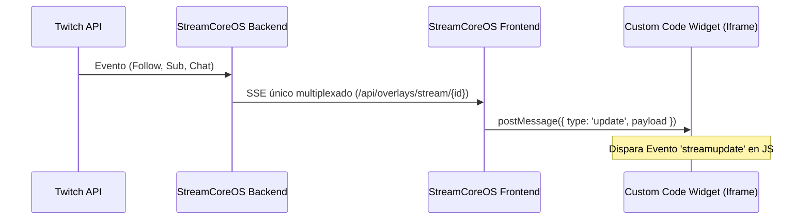

# Guía de Construcción de Overlays Personalizados en StreamCoreOS

Esta guía está diseñada para desarrolladores y streamers que desean crear overlays interactivos, dinámicos y de alto rendimiento utilizando el **Widget de Código Personalizado (Custom Code Widget)** en el constructor de StreamCoreOS.

---

## 1. Arquitectura de Datos del Overlay

StreamCoreOS utiliza una arquitectura basada en **SSE (Server-Sent Events)** en el backend para empujar actualizaciones instantáneas de eventos de Twitch, chat y contadores del canal hacia los overlays activos.

Cuando agregas un Widget de Código Personalizado, el constructor de StreamCoreOS encapsula tu código dentro de un `<iframe>` aislado por seguridad. Este iframe recibe constantemente los datos actualizados del directo del stream a través de la API de mensajería del navegador (`postMessage`).



> [!IMPORTANT]
> Un widget `custom_code` recibe **automáticamente los tres canales** (stats, chat y alertas) por SSE en tiempo real. No necesitas agregar ningún otro elemento al lienzo para que tu código reciba datos.

---

## 2. Inicialización y Eventos en JavaScript

Para que tu código personalizado pueda capturar las estadísticas y los eventos, debes suscribirte al evento `'streamupdate'` en el objeto global `window`.

### Plantilla de Inicialización Base (JS)
Copia esta plantilla en la pestaña de **JavaScript** del constructor:

```javascript
// Función principal para manejar las actualizaciones
function handleStreamUpdate(data) {
    const stats = data.stats || {};
    const alerts = data.activeAlerts || [];
    const chat = data.chatMessages || {};

    // Tu lógica de renderizado e inyección en el DOM va aquí
    updateStats(stats);
}

// 1. Cargar datos iniciales ya cacheados si existen
window.addEventListener('DOMContentLoaded', () => {
    if (window.StreamCore && window.StreamCore.stats) {
        handleStreamUpdate(window.StreamCore);
    }
});

// 2. Escuchar actualizaciones en vivo del directo
window.addEventListener('streamupdate', (event) => {
    handleStreamUpdate(event.detail);
});
```

---

## 3. Mapeo de Variables y Datos en Vivo

El objeto `data` que recibe la función anterior contiene tres propiedades principales: `stats`, `activeAlerts`, y `chatMessages`.

### A. Estadísticas Globales (`data.stats`)
Contiene los contadores del canal. Es ideal para marcadores y barras de progreso.

| Propiedad | Tipo | Descripción | Ejemplo de Uso |
| :--- | :--- | :--- | :--- |
| `followers.total` | `String` | Número total de seguidores. | `stats['followers.total']` |
| `subscribers.active_total` | `String` | Suscriptores activos. | `stats['subscribers.active_total']` |
| `stream.viewer_count` | `String` | Espectadores actuales. | `stats['stream.viewer_count']` |
| `bits.total` | `String` | Bits históricos acumulados. | `stats['bits.total']` |
| `stream.online` | `Boolean / String` | Estado del stream (`true`/`false`). | `stats['stream.online'] === true` |
| `followers.latest_name` | `String` | Nombre del último seguidor. | `stats['followers.latest_name']` |
| `subscribers.latest_name` | `String` | Nombre del último suscriptor. | `stats['subscribers.latest_name']` |
| `subscribers.latest_tier` | `String` | Tier de la última sub (`1000`/`2000`/`3000`). | `stats['subscribers.latest_tier']` |
| `cheers.latest_name` | `String` | Último usuario que donó bits. | `stats['cheers.latest_name']` |
| `cheers.latest_bits` | `String` | Cantidad de bits de la última donación. | `stats['cheers.latest_bits']` |
| `raids.latest_name` | `String` | Canal del último raid recibido. | `stats['raids.latest_name']` |
| `raids.latest_viewers` | `String` | Espectadores del último raid. | `stats['raids.latest_viewers']` |

> [!NOTE]
> La variable `stream.viewer_count` se actualiza cada 5 minutos debido a las limitaciones de rate-limit de la API de Twitch. Las demás estadísticas se actualizan instantáneamente en cuanto ocurre el evento. Las variables `*.latest_*` persisten en base de datos, por lo que sobreviven reinicios del backend y recargas del overlay.

### A.2. Pool de Variables Dinámicas (Backend → Overlay)

`data.stats` no es una lista cerrada: es un **pool abierto de variables**. Cualquier plugin del backend puede inyectar variables arbitrarias publicando un solo evento en el bus:

```python
# Desde cualquier plugin del backend (cualquier dominio):
await self.bus.publish("overlay.vars.set", {
    "meta.donaciones_hoy": 12,
    "juego.actual": "Elden Ring",
    "mi.variable.custom": "cualquier valor"
})
```

Eso es todo. Automáticamente:
1. Las variables se **persisten** en la tabla `overlay_vars` (sobreviven reinicios).
2. Se **transmiten al instante** por SSE a todos los overlays conectados que consumen stats.
3. Se **incluyen en el snapshot inicial** cuando un overlay se conecta o recarga.
4. El overlay las lee sin ningún cambio en el frontend: `stats['juego.actual']`.

Los valores pueden ser strings, números o booleanos (cualquier valor serializable a JSON). Usa nombres con formato `dominio.nombre_variable` para evitar colisiones con las claves integradas de la tabla anterior.

---

### B. Gestión de Alertas en Pantalla (`data.activeAlerts`)
Es un array con los eventos activos en ese instante. Los widgets `custom_code` reciben **todos** los eventos del stream (con una vida de 8 segundos cada uno), sin necesidad de configurar triggers. Cada objeto tiene la siguiente estructura:

```json
{
  "elementId": "__broadcast__",
  "type": "channel.follow",
  "expiresAt": 1718589000000,
  "vars": {
    "user_name": "NombreDelUsuario",
    "message": "Mensaje opcional",
    "bits": "500",
    "viewers": "150",
    "total": "5",
    "tier": "1000"
  }
}
```

> [!IMPORTANT]
> Filtra siempre por el campo `type` (el nombre exacto del evento, ver catálogo en la sección D). **Nunca** adivines el tipo de evento por la presencia o ausencia de campos en `vars` — es frágil y se rompe con eventos nuevos.

#### Ejemplo de Filtro de Alertas en JavaScript:
```javascript
function checkAlerts(alerts) {
    const followAlert = alerts.find(a => a.type === 'channel.follow');
    if (followAlert) {
        document.getElementById('alert-box').innerText = `¡Gracias por el follow, ${followAlert.vars.user_name}!`;
        document.getElementById('alert-box').classList.add('visible');
    } else {
        document.getElementById('alert-box').classList.remove('visible');
    }
}
```

---

### C. Visualización de Chat (`data.chatMessages`)
Es un diccionario que contiene los últimos mensajes de chat recibidos. 

> [!WARNING]
> **Prevención de Inyección de Código (XSS)**:
> Nunca uses `.innerHTML` para inyectar los nombres de usuario o el texto de los mensajes en el DOM (por ejemplo: `div.innerHTML = msg.message`). Si un espectador envía código HTML o etiquetas `<script>`, este código se ejecutará en tu overlay, permitiéndole alterar o "hackear" el widget.
> 
> Para renderizar el chat de forma segura:
> 1. Usa `.innerText` o `.textContent` para el texto plano y los nombres de usuario.
> 2. Usa `document.createTextNode()` al estructurar fragmentos mixtos (texto y emotes).
> 3. Aunque StreamCoreOS aisla los widgets personalizados dentro de un `<iframe>` con atributos `sandbox`, un exploit XSS aún podría inutilizar o desconfigurar visualmente tu propio overlay.

> [!TIP]
> **Mejora del Enrutamiento del Chat Nativo**:
> El sistema ha sido modificado para que el chat se canalice automáticamente tanto a los widgets de tipo `chat_highlight` como a los de tipo `custom_code`. Esto significa que **ya no necesitas agregar un elemento de chat estándar adicional** al lienzo para que tu código personalizado reciba el chat. Se inyecta de manera automática usando el ID del propio widget de código personalizado.

#### Ejemplo de renderizado de Chat con Emotes:
```javascript
function renderChat(chatData) {
    // Obtenemos la lista de mensajes de chat asociada a tu widget
    const widgetId = Object.keys(chatData)[0];
    if (!widgetId) return;

    const messages = chatData[widgetId] || [];
    const chatContainer = document.getElementById('chat-box');
    chatContainer.innerHTML = ''; // Limpiar chat

    messages.forEach(msg => {
        const msgEl = document.createElement('div');
        msgEl.className = 'message';
        
        // 1. Nombre de usuario con color de Twitch
        const userSpan = document.createElement('span');
        userSpan.innerText = `${msg.display_name}: `;
        userSpan.style.color = msg.color || '#38bdf8';
        msgEl.appendChild(userSpan);

        // 2. Renderizar texto y emotes usando "fragments"
        const contentSpan = document.createElement('span');
        msg.fragments.forEach(frag => {
            if (frag.type === 'emote') {
                const img = document.createElement('img');
                const fmt = frag.emote_animated ? 'animated' : 'static';
                img.src = `https://static-cdn.jtvnw.net/emoticons/v2/${frag.emote_id}/${fmt}/dark/1.0`;
                img.className = 'chat-emote';
                contentSpan.appendChild(img);
            } else {
                contentSpan.appendChild(document.createTextNode(frag.text));
            }
        });
        msgEl.appendChild(contentSpan);
        chatContainer.appendChild(msgEl);
    });
}
```

### D. Catálogo de Eventos y Variables Disponibles (activeAlerts)

Cuando utilices el Widget de Código Personalizado (`custom_code`) en el constructor, la estructura de datos que recibirás para las alertas o eventos dentro de `data.activeAlerts` contiene un objeto `vars`.

A continuación se detalla la lista completa de eventos de Twitch y del sistema integrados en StreamCoreOS, junto con las variables que vienen en cada uno:

#### 1. Twitch y Eventos del Directo (`activeAlerts`)

| Evento (`type` / `event`) | Descripción | Campos en `vars` | Ejemplo de Estructura JSON |
| :--- | :--- | :--- | :--- |
| **`channel.follow`** | Nuevo seguidor en el canal. | <ul><li>`user_name`: Nombre visible del seguidor.</li><li>`user_login`: Username del seguidor (minúsculas).</li></ul> | `{"user_name": "StreamFan123", "user_login": "streamfan123"}` |
| **`channel.subscribe`** | Suscripción inicial o renovación (Resub). | <ul><li>`user_name`: Nombre del suscriptor.</li><li>`tier`: Nivel (`1000` = T1, `2000` = T2, `3000` = T3).</li><li>`is_gift`: Booleano en formato texto (`"true"`/`"false"`).</li><li>`message`: Mensaje adjunto (opcional).</li><li>`cumulative_months`: Meses totales (solo en resub).</li><li>`streak_months`: Racha de meses (solo en resub).</li></ul> | `{"user_name": "TopSub99", "tier": "1000", "is_gift": "false", "message": "¡Los mejores!", "cumulative_months": "6"}` |
| **`channel.subscription.gift`** | Un usuario regala suscripciones a la comunidad. | <ul><li>`user_name`: Donador de la sub (o `"Anónimo"`).</li><li>`total`: Cantidad de subs regaladas.</li><li>`tier`: Nivel (`1000`, `2000`, `3000`).</li></ul> | `{"user_name": "GiftKing", "total": "5", "tier": "1000"}` |
| **`channel.cheer`** | Donación de bits (Cheer) en el chat. | <ul><li>`user_name`: Nombre de quien mandó bits (o `"Anónimo"`).</li><li>`bits`: Cantidad de bits donados.</li><li>`message`: Mensaje que acompaña la donación.</li></ul> | `{"user_name": "BitsMaster", "bits": "1000", "message": "¡Gran directo!"}` |
| **`channel.raid`** | Invasión (Raid) desde otro canal. | <ul><li>`user_name` / `from_broadcaster_user_name`: Nombre del canal invasor.</li><li>`viewers`: Cantidad de espectadores que llegan.</li></ul> | `{"user_name": "FriendStream", "viewers": "247"}` |
| **`channel.channel_points_custom_reward_redemption.add`** o **`loyalty.reward.redeemed`** | Canje de recompensa de puntos de canal de Twitch. | <ul><li>`display_name` / `user_name`: Espectador que canjeó.</li><li>`reward_name` / `reward.title`: Nombre del canje (ej: `"TTS"`).</li><li>`cost`: Puntos consumidos.</li><li>`user_input`: Texto ingresado si el canje requiere escribir.</li></ul> | `{"display_name": "ViewerPuntos", "reward_name": "Activar Sonido", "cost": "250", "user_input": "sonido.mp3"}` |

#### 2. YouTube Live y Monetización (`activeAlerts`)

StreamCoreOS integra automáticamente la transmisión de eventos de YouTube:

| Evento (`type`) | Descripción | Campos en `vars` | Ejemplo de Estructura JSON |
| :--- | :--- | :--- | :--- |
| **`youtube.superchat`** | Donación de Super Chat en directo. | <ul><li>`user_name`: Nombre del donante.</li><li>`display_amount`: Monto formateado (ej: `"$10.00"`).</li><li>`message`: Mensaje del Super Chat.</li><li>`currency`: Código de divisa.</li></ul> | `{"user_name": "AlexYT", "display_amount": "$10.00", "message": "¡Gran stream!", "currency": "USD"}` |
| **`youtube.supersticker`** | Donación de Super Sticker de YouTube. | <ul><li>`user_name`: Nombre del donante.</li><li>`display_amount`: Monto formateado.</li><li>`message`: Texto alternativo del sticker.</li></ul> | `{"user_name": "FanSuper", "display_amount": "$5.00", "message": "Super Sticker"}` |
| **`youtube.member`** | Nueva membresía o patrocinio de canal. | <ul><li>`user_name`: Nombre del nuevo miembro.</li><li>`message`: Detalle o nivel de membresía.</li></ul> | `{"user_name": "SocioVIP", "message": "se hizo miembro del canal"}` |

#### 3. Eventos del Ciclo de Vida del Stream y Sistema

Estos eventos se pueden capturar para ejecutar acciones automáticas en tu overlay (como activar/desactivar overlays de inicio, activar efectos, etc.):

*   **`stream.session.started`** (Canal inicia directo):
    *   `broadcaster_login`: Nombre del streamer.
    *   *Ejemplo*: `{"broadcaster_login": "mi_canal"}`
*   **`stream.session.ended`** (Canal finaliza directo):
    *   No tiene variables específicas.
*   **`viewer.points.awarded`** (Puntos otorgados al chat):
    *   `display_name`: Espectador premiado.
    *   `amount`: Cantidad de puntos sumados.
    *   `reason`: Causa (ej: `"active_chat"`).
*   **`moderation.action.taken`** (Acción de moderación ejecutada):
    *   `display_name`: Usuario afectado.
    *   `action`: Acción ejecutada (`timeout`, `ban`, `clear`, etc.).
    *   `reason`: Razón ingresada por el moderador.

#### 4. Estructura Multiplataforma de Chat (`chatMessages`)

A través de `data.chatMessages` en el constructor, cada objeto de mensaje contiene la plataforma de origen (`'youtube'` o `'twitch'`) y los datos del espectador:

```json
{
  "platform": "youtube",
  "display_name": "NombreDeUsuario",
  "message": "Mensaje en texto plano",
  "timestamp": 1718589000000,
  "color": "#ff4e45",
  "user": {
    "id": "youtube:UC1234567890",
    "display_name": "NombreDeUsuario",
    "avatar_url": "https://yt3.ggpht.com/..."
  },
  "roles": {
    "broadcaster": false,
    "moderator": false,
    "subscriber": true
  },
  "badges": [
    { "set": "member", "version": "1" }
  ],
  "fragments": [
    { "type": "text", "text": "Hola a todos!" }
  ]
}
```

##### 🎯 Cómo Filtrar Solo Chat de YouTube en JavaScript:
```javascript
window.addEventListener('streamupdate', (event) => {
  const chatData = event.detail.chatMessages || {};
  const allMessages = Object.values(chatData).flat();
  
  // FILTRAR SOLO YOUTUBE:
  const youtubeMsgs = allMessages.filter(msg => msg.platform === 'youtube');
  
  youtubeMsgs.forEach(msg => {
    console.log(`[YouTube] ${msg.display_name}: ${msg.message}`);
    if (msg.user?.avatar_url) {
      // Renderizar avatar del canal de YouTube
    }
  });
});
```

---


## 4. Técnicas Avanzadas de Enmascaramiento y Neón

Para overlays de OBS de pantalla completa, la forma más limpia y eficiente de recortar áreas transparentes para tu juego y cámara es utilizar la propiedad `mask-image` de CSS junto a SVGs embebidos como Data URIs.

### A. Máscara CSS SVG en Línea
Para definir áreas transparentes, puedes usar un SVG embebido directamente en tu hoja de estilos CSS:

```css
.masked-background {
    position: absolute;
    width: 1920px;
    height: 1080px;
    background: #090a0f; /* Color sólido o gradiente */
    
    /* El SVG define rectángulos negros en las zonas que queremos que sean TRANSPARENTES */
    mask-image: url("data:image/svg+xml;utf8,<svg xmlns='http://www.w3.org/2000/svg' width='1920' height='1080'><mask id='m'><rect width='1920' height='1080' fill='white'/><rect x='10' y='11' width='1570' height='1004' rx='8' fill='black'/><rect x='1590' y='621' width='320' height='394' rx='8' fill='black'/></mask><rect width='1920' height='1080' fill='white' mask='url(%23m)'/></svg>");
    -webkit-mask-image: url("data:image/svg+xml;utf8,<svg xmlns='http://www.w3.org/2000/svg' width='1920' height='1080'><mask id='m'><rect width='1920' height='1080' fill='white'/><rect x='10' y='11' width='1570' height='1004' rx='8' fill='black'/><rect x='1590' y='621' width='320' height='394' rx='8' fill='black'/></mask><rect width='1920' height='1080' fill='white' mask='url(%23m)'/></svg>");
    mask-size: 100% 100%;
}
```

### B. Borde de Neón Recorriendo los Marcos (SVG)
Para crear un haz de luz láser de neón que recorra los bordes de tus recuadros de forma infinita, puedes utilizar el atributo `stroke-dasharray` animado:

```xml
<svg class="neon-svg" viewBox="0 0 1920 1080">
    <!-- El perímetro de este rectángulo es: (1570*2) + (1004*2) = 5148px -->
    <!-- Definimos un trozo de línea de 200px con un espacio vacío gigante -->
    <rect class="neon-rect" x="10" y="11" width="1570" height="1004" rx="8" />
</svg>
```

```css
.neon-rect {
    fill: none;
    stroke: #00f0ff;
    stroke-width: 2.5;
    stroke-linecap: round;
    stroke-dasharray: 200 4948; /* Línea de 200px, vacío de 4948px */
    animation: travelBorder 30s linear infinite;
    filter: drop-shadow(0 0 5px #00f0ff);
}

@keyframes travelBorder {
    from { stroke-dashoffset: 5148; }
    to { stroke-dashoffset: 0; }
}
```

## 5. Superpoderes de Desarrollo (Hacer absolutamente cualquier cosa)

Al estar aislado en un iframe dentro de la vista final del overlay, tu Widget de Código Personalizado posee todas las capacidades de una página web moderna estándar ejecutándose bajo el navegador interno de OBS (CEF). Esto te permite desbloquear funcionalidades extremadamente avanzadas:

### A. Importación de Librerías Externas desde CDN
Puedes incluir cualquier framework o librería directamente en la pestaña **HTML** utilizando etiquetas `<script>` o `<link>` de CDNs públicas (como cdnjs o unpkg):

```html
<!-- Importar Canvas Confetti para animaciones de celebración -->
<script src="https://cdn.jsdelivr.net/npm/canvas-confetti@1.9.3/dist/confetti.browser.min.js"></script>

<!-- Importar GSAP para animaciones ultra fluidas y profesionales -->
<script src="https://cdnjs.cloudflare.com/ajax/libs/gsap/3.12.5/gsap.min.js"></script>
```

#### Ejemplo de uso en la pestaña JavaScript (JS):
```javascript
window.addEventListener('streamupdate', (event) => {
    const alerts = event.detail.activeAlerts || [];
    // Si hay una alerta de follow activa, lanzar confeti
    if (alerts.some(a => a.type === 'channel.follow')) {
        confetti({
            particleCount: 100,
            spread: 70,
            origin: { y: 0.6 }
        });
    }
});
```

---

### B. Persistencia del Estado (`localStorage` / `sessionStorage`)
El caché del navegador de OBS retiene la información de `localStorage`. Puedes usarlo para almacenar configuraciones dinámicas, marcadores históricos o estados del stream que persistan aun si cambias de escena o reinicias OBS:

```javascript
// Obtener un contador de follows histórico guardado localmente
let historicFollows = parseInt(localStorage.getItem('sco_follows_count') || '0');

window.addEventListener('streamupdate', (event) => {
    const followersTotal = parseInt(event.detail.stats['followers.total'] || '0');
    
    if (followersTotal > historicFollows) {
        historicFollows = followersTotal;
        localStorage.setItem('sco_follows_count', historicFollows.toString());
        triggerNewFollowAnimation();
    }
});
```

---

### C. Efectos de Sonido Dinámicos (Audio API)
Puedes reproducir efectos de sonido (SFX) asociados a alertas de chat o eventos específicos llamando directamente a la API de Audio de JavaScript sin necesidad de declarar un elemento `<audio>` en el HTML:

```javascript
function playAlertSound(url) {
    const audio = new Audio(url);
    audio.volume = 0.5; // Ajustar volumen al 50%
    audio.play().catch(err => console.error("Error reproduciendo audio:", err));
}

// Ejemplo: Reproducir un sonido en cada mensaje de chat destacado
window.addEventListener('streamupdate', (event) => {
    const chat = event.detail.chatMessages || {};
    // ... lógica de filtrado de mensaje ...
    playAlertSound('https://miservidor.com/sounds/alert.mp3');
});
```

---

### D. Conexión a APIs Externas (`fetch`)
Puedes consultar en tiempo real cualquier API REST externa o mandar webhooks a tus propios servidores de Discord u otros flujos de automatización:

```javascript
// Obtener el precio actual de Bitcoin para mostrarlo en el banner
async function updateCryptoPrice() {
    try {
        const res = await fetch('https://api.coingecko.com/api/v3/simple/price?ids=bitcoin&vs_currencies=usd');
        const data = await res.json();
        document.getElementById('btc-display').innerText = `BTC: $${data.bitcoin.usd}`;
    } catch (e) {
        console.error("Error al obtener precio de cripto:", e);
    }
}

// Actualizar cada 60 segundos
setInterval(updateCryptoPrice, 60000);
```
